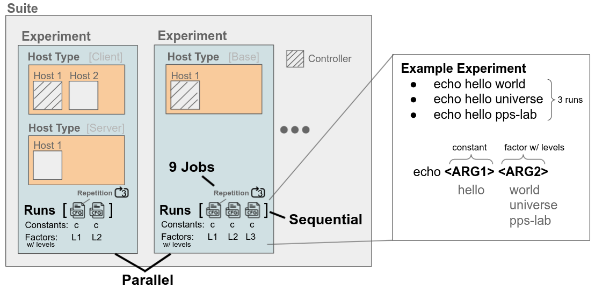

<!-- PROJECT LOGO -->
<br />
<p align="center">
  <a href="https://github.com/nicolas-kuechler/doe-suite">
    
  </a>

  <h3 align="center">DoES - Design of Experiments Suite</h3>

  <p align="center">
   Orchestrate benchmarking experiments on AWS EC2 machines or the ETHZ Euler cluster. Besides supporting experiments on a single instance, e.g., train an ML model, we also support multi-instance experiments, e.g., client-server.
  </p>
</p>


## About The Project

The Design of Experiment Suite (DoES) automatically orchestrates and executes a set of experiments, i.e., an experiment suite, based on a simple declarative `YAML`  design file. In essence, the design file follows a DSL to specify experiments.
Each experiment of a suite defines the involved computing resources (e.g., AWS EC2 instances) as well as a list of run configurations.
DoES follows the naming conventions of [DoE](https://en.wikipedia.org/wiki/Design_of_experiments):
A `factor` is a parameter that changes between different runs, and in each run, a `factor` takes a particular `level`, i.e., value.
For example, we could have a `factor` to vary the load and find the saturation point of a system.

First DoES creates the required resources (e.g., AWS EC2 instances), installs packages, and builds the artifact.
Afterward, DoES executes jobs according to the suite design.
We support multi-factor and multi-level experiment designs with repetition,
i.e., it is possible to vary multiple parameters and repeat each run.
After completing a job, DoES automatically downloads generated result files and processes them in an ETL pipeline to generate summaries and plots.
Finally, all created resources are automatically cleaned up.

### Example: Suite Design

The core of DoES are suite design files that define a set of experiments and how to process results.
In essence, the example suite below runs an experiment with 8 configurations (cross-product of the two factors `payload_size_mb` and `opt`) and repeats each run 3 times.
Note that suite designs are not limited to the cross-product of factors.
Finally, the ETL pipeline processes the results and creates a table and a plot.

<a align="center">
    
</a>
<!-- TODO [nku] improve styling and quality of the overview figure-->

<!--
```YAML
experiment_1:
  n_repetitions: 3
  host_types:
    small:
      n: 1
      init_roles: setup-small
      $CMD$: "{{ exp_code_dir }}/demo_project/.venv/bin/python {{ exp_code_dir }}/demo_project/demo_latency.py --opt [% my_run.opt %] --size [% my_run.payload_size_mb %] --out [% my_run.out %]"
  base_experiment:
    out: json
    payload_size_mb:
      $FACTOR$: [10, 20, 30, 40]
    opt:
      $FACTOR$: [True, False]

$ETL$:
  pipeline1:
    experiments: [experiment_1]
    extractors:
      JsonExtractor: {}
      ErrorExtractor: {}
      IgnoreExtractor: {}
    transformers:
      - name: RepAggTransformer
        data_columns: [latency]
    loaders:
      CsvSummaryLoader: {}
      DemoLatencyPlotLoader: {}

```
-->


#### Detailed Explanation

The suite design consists of a single experiment `experiment_1` that runs on a single machine of type `small`, e.g., an EC2 instance.
The experiment runs a script `demo_latency.py` that takes three command line arguments: `--opt`, `--size` (i.e., `payload_size_mb`), and `--out`.
Naturally, the experiment config in `base_experiment` consists of these three arguments.
In the experiment, we want to measure the latency for different sizes `--size` with and without the optimization `--opt`.
As a result, these two parameters are marked as factors, i.e., with  `$FACTOR$` and a list of `levels` in each run, we use a different combination of the levels when running the script `demo_latency.py`.

The factor `payload_size_mb` has 4 levels, while the factor `opt` has 2 levels.
In this format we run the cross-product of all factors which results in 4x2=8 different runs.
We repeat each run `n_repetitions: 3` times and hence we end up with 3*8=24 experiment jobs.

Once an experiment job is complete, we process the resulting files (produced by the job) in an ETL pipeline.
In the Extract stage we use the listed extractors to create a result table (dataframe) based on the result files of the job.
We assign each file to exactly one extractor by matching a regex on the filename. (e.g., all files ending in `.json` are processed by the `JsonExtractor`)
In the following Transform stage, we apply a chain of Transformers on the table from the Extract stage.
Here, the `RepAggTransformer` aggregates over the repetitions of an experiment run config, i.e., calculates mean, std, etc. over the repetitions.
Finally, in the Load stage, we execute all Loaders with the table from the Transform stage.
Here, the `CsvSummaryLoader`stores the table in form of a csv and the `DemoLatencyPlotLoader` creates an experiment-specific plot for the experiment.

After discussing an example, the remainder of the readme is structured as follows:

<!-- TABLE OF CONTENTS -->
<!-- TODO [nku] update the ToC-->
<details open="open">
  <summary>Table of Contents</summary>
  <ol>
    <li>
      <a href="#about-the-project">About The Project</a>
      <ul>
        <li><a href="#built-with">Built With</a></li>
      </ul>
    </li>
    <li>
      <a href="#getting-started">Getting Started</a>
      <ul>
        <li><a href="#prerequisites">Prerequisites</a></li>
        <li><a href="#installation">Installation</a></li>
      </ul>
    </li>
    <li>
      <a href="#usage">Usage</a>
      <ul>
        <li><a href="#moving-beyond-the-example-experiment">Moving beyond the Example Experiment</a></li>
        <li><a href="#design-of-experiments">Design of Experiments</a></li>
        <li><a href="#running-an-experiment">Running an Experiment</a></li>
        <li><a href="#cleaning-up-aws">Cleaning up AWS</a></li>
        <li><a href="#experimental-results">Experimental Results</a></li>
      </ul>
    </li>
    <li><a href="#license">License</a></li>
    <li><a href="#contact">Contact</a></li>
  <!--<li><a href="#acknowledgements">Acknowledgements</a></li> -->
  </ol>
</details>

## Cheatsheet

Quick reference for the most important commands.

:warning: Ensure that the environment variable `DOES_PROJECT_DIR` points to the project directory.

```sh
# hint: can set the environment variables with `direnv` in an .envrc

# expect does-config-dir in this folder
export DOES_PROJECT_DIR=<PATH>

# a unique short name, allows that multiple people can work on the same project
export DOES_PROJECT_ID_SUFFIX=<SUFFIX>

# name of ssh key used for setting up access to aws machines
export DOES_SSH_KEY_NAME=<SSH_KEY_NAME>

# eth nethz account for using euler cluster
export DOES_EULER_USER=<NETHZ>

```

### Running Experiments

Start an experiment suite:
  ```sh
  make run suite=example01-minimal id=new
  ```

Continue the last experiment suite:
  ```sh
  make run suite=example01-minimal id=last
  ```

Start an experiment suite on a specific cloud:
  ```sh
  make run suite=example01-minimal id=new cloud=euler
  ```

Start an experiment suite with the explicit choice (`run-keep`, `run-stop`, `run-terminate`) what to do after suite is complete:
  ```sh
  make run-keep suite=example01-minimal id=new
  make run-stop suite=example01-minimal id=new
  make run-terminate suite=example01-minimal id=new
  ```

### ETL

Run ETL results pipeline:
  ```sh
  # can replace `id=last` with actual id, e.g., `id=1655831553`
  make etl suite=example01-minimal id=last
  ```

Run Super-ETL results pipeline:
  ```sh
  # can set `out` for example to a figures folder of a paper
  make etl-super config=demo_plots out=.
  ```

### Status and Info

Get information about available suites and experiments:
  ```sh
  make info
  ```

Get progress information about the last suite run:
  ```sh
  # w/o suite filter (all suites)
  make status id=last
  ```

  ```sh
  # w/ suite filter
  make status suite=example01-minimal id=last
  ```

### Cleanup

Terminate all remote resources, e.g., terminate all EC2 instances, and local cleanup, e.g., pycache:
  ```sh
  make clean
  ```

### Developing

:warning: Ensure that the environment variable `DOES_PROJECT_DIR` points to the project directory.

Configure Project: Initialize `doe-suite-config` from a template
  ```sh
  make new
  ```

List all commands that a suite design defines (+ Visualize ETL pipelines)
  ```sh
  make design suite=example01-minimal
  ```

Validate a design and show  the design with default values assigned:
  ```sh
  make design-validate suite=example01-minimal
  ```

Developing ETL pipeline by using the pipeline from the design:
  ```sh
  # can replace `id=last` with actual id, e.g., `id=1655831553`
  make etl-design suite=example01-minimal id=last

  # The same as: `make etl suite=example01-minimal id=last`
  #   but uses the etl pipeline defined in `doe-suite-config/designs`
  #   compared to the etl pipeline in `doe-suite-results/example01-single_<ID>/suite_design.yml`
  ```

### Overview

To get an overview of the functionality use `make` or `make help`:

```
Running Experiments
  make run suite=<SUITE> id=new                       - run the experiments in the suite
  make run suite=<SUITE> id=<ID>                      - continue with the experiments in the suite with <ID> (often id=last)
  make run suite=<SUITE> id=<ID> cloud=<CLOUD>        - run suite on non-default cloud ([aws], euler)
  make run suite=<SUITE> id=<ID> expfilter=<REGEX>    - run only subset of experiments in suite where name matches the <REGEX>
  make run-keep suite=<SUITE> id=new                  - does not terminate instances at the end, otherwise works the same as run target
Clean
  make clean                                          - terminate running cloud instances belonging to the project and local cleanup
  make clean-result                                   - delete all results in doe-suite-results except for the last (complete) suite run per suite
Running ETL Locally
  make etl suite=<SUITE> id=<ID>                      - run the etl pipeline of the suite (locally) to process results (often id=last)
  make etl-design suite=<SUITE> id=<ID>               - same as `make etl ...` but uses the pipeline from the suite design instead of results
  make etl-all                                        - run etl pipelines of all results
  make etl-super config=<CONFIG> out=<PATH>           - run the super etl to combine results of multiple suites  (for <CONFIG> e.g., demo_plots)
Clean ETL
  make etl-clean suite=<SUITE> id=<ID>                - delete etl results from specific suite (can be regenerated with make etl ...)
  make etl-clean-all                                  - delete etl results from all suites (can be regenerated with make etl-all)
Gather Information
  make info                                           - list available suite designs
  make status suite=<SUITE> id=<ID>                   - show the status of a specific suite run (often id=last)
Design of Experiment Suites
  make design suite=<SUITE>                           - list all the run commands defined by the suite
  make design-validate suite=<SUITE>                  - validate suite design and show with default values
Setting up a Suite
  make new                                            - initialize doe-suite-config from a template
Running Tests
  make test                                           - running all suites (seq) and comparing results to expected (on aws)
  make euler-test cloud=euler                         - running all single instance suites on euler and compare results to expected
  make etl-test-all                                   - re-run all etl pipelines and compare results to current state (useful after update of etl step)
```

<!-- GETTING STARTED -->
## Getting Started

To get started, the DoE-Suite provides a [demo project](demo_project) that shows the required structure to integrate DoES into an existing project.
After completing the getting started section, it should be possible to run the [example suite designs](demo_project/doe-suite-config/designs) of the demo project.

Afterward, you can change the environment variable `DOES_PROJECT_DIR` to point to your own project (instead of the demo project) and continue from there.

#### Built With

* [Ansible](https://www.ansible.com/)
* [YAML](https://yaml.org/)
* [Jinja](https://jinja.palletsprojects.com/en/3.0.x/)

### Prerequisites

* We assume that you already have an existing project for which you want to run benchmarks with DoES (otherwise, just create a dummy project).

* Before starting, ensure that you have `poetry` installed [(see instructions)](https://python-poetry.org/docs/).

* Moreover, ensure that you have `cookieclutter` installed [(see instructions)](https://cookiecutter.readthedocs.io/en/stable/installation.html).

* For using the AWS cloud, create a `key pair for AWS` in the region `eu-central-1` [(see instructions)](https://docs.aws.amazon.com/servicecatalog/latest/adminguide/getstarted-keypair.html).

* For using the ETHZ Euler cloud: ensure that you can connect to `euler.ethz.ch` with ssh [(see instructions)](https://scicomp.ethz.ch/wiki/Accessing_the_clusters#SSH)

* Finally, ensure you can clone remote `repositories with SSH` [(see instructions for GitHub)](https://docs.github.com/en/github/authenticating-to-github/connecting-to-github-with-ssh).


### Installation

After this section, it should be possible to run the example designs of the demo project.
For example: `make run suite=example01-minimal id=new`

1. Add the DoES repository as a submodule to your project repository.
    ```sh
    git submodule add git@github.com:nicolas-kuechler/doe-suite.git
    ```

2. Configure `ssh` and `ssh-agent`.

      * Configure ~/.ssh/config:  (add to file and replace the key for AWS, for example, with aws_ppl.pem)
          ```
          Host ec2*
          IdentityFile ~/.ssh/{{ ssh_key_name }}
          User ubuntu
          ForwardAgent yes
          ```
      * Add the GitHub private key to ssh-agent.
        This allows cloning a GitHub repository on an EC2 instance without copying the private key or entering credentials.
        The process depends on your environment but should be as follows [(source)](https://docs.github.com/en/github/authenticating-to-github/connecting-to-github-with-ssh):

          1. Start ssh-agent in the background:
              ```sh
              eval "$(ssh-agent -s)"
              ```
          2. Add SSH private key to ssh-agent (replace with your key):
              ```sh
              ssh-add ~/.ssh/<YOUR PRIVATE KEY>
              ```
          3. (On a MAC, need add to keychain)


3. Install AWS CLI (version 2) and configure Boto

      * Install AWS CLI version 2 [(see instructions)](https://docs.aws.amazon.com/cli/latest/userguide/install-cliv2.html)

      * Configure AWS credentials for Boto [(see instructions)](https://boto3.amazonaws.com/v1/documentation/api/latest/guide/quickstart.html)
        ```sh
        aws configure
        ```
        By default, credentials should be in `~/.aws/credentials`.


4. Set the environment variables listed below.
Hint, [direnv](https://direnv.net/) allows project-specific env vars in an `.envrc` file.
  ```sh
  # the root of your project repository, later we expect does-config-dir in this folder
  export DOES_PROJECT_DIR=<PATH> # !!! For now set to absolute path of demo project: `doe-suite/demo_project`

  # your unique shortname, e.g., nku
  export DOES_PROJECT_ID_SUFFIX=<SUFFIX>

  # name of ssh key used for setting up access to aws machines
  export DOES_SSH_KEY_NAME=<SSH_KEY_NAME>

  # for eth euler cluster: your nethz account
  export DOES_EULER_USER=<NETHZ>
  ```

The variables `DOES_PROJECT_DIR` and `DOES_PROJECT_ID_SUFFIX` need to be set in any project.
Running experiments on AWS requires `DOES_SSH_KEY_NAME` and running experiments on `DOES_EULER_USER`.


5. Check that the [example01-minimal.yml](demo_project/doe-suite-config/designs/example01-minimal.yml)  of the `demo_project` runs in your setup. In the `doe-suite` repository, run the command below to run the example on AWS.
    ```sh
      make test-example01-minimal
    ```
For running the same example on the ETH Euler cloud, use:
    ```sh
      make test-example01-minimal cloud=euler
    ```


<!-- USAGE -->
## Usage

Before we show how to use the suite, we discuss the structure of a project that uses the doe-suite.

In every project repo, we add three top level folders: `doe-suite`, `doe-suite-config`, and `doe-suite-results`.
The `doe-suite` folder is the doe-suite repo as a submodule.
The `doe-suite-config` folder contains the whole configuration of how to run experiments + project specific extensions of the suite.
In the `doe-suite-results` folder all the result files are stored.

The resulting folder structure for a project looks as follows:
(where the environment variable `DOES_PROJECT_DIR` points to)

<pre><code>
.
├── <b>doe-suite</b>                     # The doe-suite repo as a submodule -> can use the main branch or some specific branch with a custom extension
├── <b>doe-suite-config</b>                   # Configuration for DoE-Suite
│   ├── <b>designs</b>                       # Folder with suite designs that define the experiments
│   │   ├── &ltsuite1&gt.yml
│   │   └── &ltsuite2&gt.yml
│   ├── <b>etl</b>                           # Folder with custom etl-pipeline steps (e.g., code to generate a plot from the results)
│   │   └── &ltproject_specific&gt.py
│   ├── <b>group_vars</b>                    # Folder with ansible playbook group vars (config) for host_types
│   │   ├── all                           # General config
│   │   │   └── main.yml
│   │   ├── &lthost_type1&gt                  # Host type specific config
│   │   │   └── main.yml
│   │   └── &lthost_type2&gt                  # Host type specific config
│   │       └── main.yml
│   └── <b>roles</b>                         # Folder with custom roles to setup host_types
│       ├── &ltsetup-host_type1&gt
│       │   └── ...
│       └── &ltsetup-host_type2&gt
│           └── ...
├── <b>doe-suite-results</b>                  # Folder (auto created by doe-suite) that contains results.
│   └── ...
└── ...                           # <b>existing project files, i.e, artifact</b>
</code>
</pre>

### Moving beyond the Demo Project
After the getting started section, we can run the suite designs from the `demo_project`.
To use the suite in your project, you must follow the folder structure shown above and change the environment variable `DOES_PROJECT_DIR` from pointing to the `demo_project` to your project.

To help you setting up the `doe-suite-config` folder structure, it is possible to initialize a new config based on a [cookiecutter template](cookiecutter-doe-suite-config).
After changing the `DOES_PROJECT_DIR` env variable, run the command below from the `doe-suite` repo.
The target helps to create a `doe-suite-config` folder in `DOES_PROJECT_DIR`.
For a start, it should be fine to accept default values except for the **repo** you should use the repo of your project instead of the `doe-suite`repo.
  ```sh
    make new
  ```

Now

### Running an Experiment Suite

We run an experiment suite by starting the Ansible playbook.
We provide the name of an experiment suite design from `doe-suite-config/designs` (e.g., `example01-minimal`), and we use `id=new` to run a new complete experiment.

```sh
make run suite=example01-minimal id=new
```

The playbook reads the **environment variable** `DOES_PROJECT_DIR` which must point to the project folder.
For example, when we want to run the `demo_project` then we set `DOES_PROJECT_DIR=<...>/doe-suite/demo_project`.
Within the project folder, the suite expects that there is a `doe-suite-config` folder that controls how to run the suite.

When we start a new experiment suite, it receives a unique ID (epoch timestamp). Each experiment of the suite must have a unique name in the experiment design specification.

The playbook periodically checks whether an experiment run is finished and then downloads the results.
The variable `job_n_tries` controls the maximum number of times to check whether the job finished.
In between checking, the playbook waits for `job_check_wait_time` seconds (see `doe-suite-config/group_vars/all/main.yml`).
After the number of `job_n_tries` is exceeded, the playbook aborts.

Experiments that involve multiple instances (e.g., client-server experiment) require the experiment-suite playbook to start the next job after the previous finished. The consequence is that when the playbook aborts because `job_n_tries` is exceeded,  an already running job will continue to run on AWS, but the next job won't start unless the `experiment-suite.yml` playbook runs.

For experiments that run on a single instance, all jobs are scheduled on the instance from the beginning. As a consequence, after a job completes, the next job automatically starts even when the `experiment-suite.yml` playbook does not run. In this case, the playbook is only required to fetch results.


To continue checking a previously started experiment, we can specify the ID of the experiment when starting the playbook:

```sh
make run suite=example01-minimal id=<ID>
```

For convenience, we can also use `id=last` to continue executing the most recent experiment suite (the one with the highest suite ID).

```sh
make run suite=example01-minimal id=last
```

### Cleaning up AWS

By default, after an experiment suite is complete, all _experiment_ resources created on AWS are terminated.

Creating resources on AWS and setting up the environment takes a considerable amount of time. So, for debugging and short experiments, it can make sense not to terminate the instances. If you use this flag, be sure to check that instances are terminated when you are done.

Example:
```sh
make run-keep suite=<SUITE> id=new
```

Furthermore, we also provide a playbook to terminate all AWS resources:
```sh
make clean
```

:warning: The ansible controller instance, if used, is not removed. It is intended to be left running and trigger individual experiment runs.

### Experimental Results

The experiment suite creates a matching folder structure on the localhost and the remote EC2 instances.

Locally, each experiment job (repetition of an experiment run with a specific config) receives a separate folder, i.e., working directory:

`<DOES_PROJECT_DIR>/doe-suite-results/<SUITE>_<SUITE ID>/<EXPERIMENT>/run_<RUN>/rep_<REPETITION>`

- `RUN` is the index of the run (starts at 0)
- `REPETITION`is the index of the repetitions (starts at 0)

In this folder, we group the involved hosts by host type and have a separate folder for each involved EC2 instance where all result files are downloaded.

`<HOST TYPE>/host_<HOST INDEX>`

- `HOST TYPE` is the host type from the suite design
- `HOST INDEX` is the index of the host (starts for each host type at 0)


Example:
The folder `doe-suite-results/example04-multi_1634661802/exp_client_server/run_2/rep_1/client/host_0` contains all result files from the 1st client host, from the 2nd repetition (rep starts with 0) of the 3rd run (run starts at 0) from the experiment named `exp_client_server` that is part of the suite `example04-multi` with id `1626423613`.

The artifact (code) is executed on the remote machine in the experiment job's working directory. There are two folders in this working directory: `results` and `scratch`. Only the files in `results` are download at the end of the experiment job to the local machine.


## Suite Design

<a align="center">
    
</a>

The figure above shows that a suite design consists of one or more experiments.
Each experiment defines the computational environment (i.e., how many machines of which type) and a list of run configurations (i.e., concrete parameters) that we want to execute.
Within the run configurations we distinguish between constants and factors.
Constant remain the same across all runs, while for factors, we use in each run a unique combination of their levels.
To improve validity, we support repeating a run multiple times.

Different experiments in the suite are executed on a different set of host instances **in parallel**, while run configurations within an experiment are executed **sequentially** on the same set of host instances.

For each experiment, one instance is the controller which is logically responsible for coordination.

### Suite Designs by Example

The experiment suite runs experiments based on `YAML` files in `doe-suite-config/designs`.
The `YAML` files represent the structure discussed above.
We provide a series of suite designs to demonstrate the different features by example:

1. [example01-minimal](demo_project/doe-suite-config/designs/example01-minimal.yml) shows the minimal suite design with a single experiment on a single host and no ETL pipeline.

2. [example02-single](demo_project/doe-suite-config/designs/example02-single.yml) demonstrates that:
    *  a suite can consist of multiple experiments that are executed in parallel (here 2 experiments)
    * `init_roles` in host_type defines an ansible role to install packages etc. on a host
    * a `config.json` file with the run config is within the working directory of the `$CMD$` -> can be used to pass config parameters
    * we can repeat each run configuration multiple times (`n_repetitions`).
    * an `$ETL$` pipeline can automatically process result files (e.g., extract from result structure, transform into a suited df, load a summary)

3. [example03-format](demo_project/doe-suite-config/designs/example03-format.yml) demonstrates the use of the two (three) formats for expressing factors (varying parameters).

4. [example04-multi](demo_project/doe-suite-config/designs/example04-multi.yml) demonstrates:
    * an experiment involving multiple instances (e.g., client-server)
    * that `common_roles` lists roles executed on all host_types, while `init_roles` is a host_type specific role.
    * the use of the variable `exp_host_lst` in $CMD$ to get the dns name of of other instances (e.g., get dns name of server)
    * the use of `check_status`, to control when an experiment job is considered to be over. If set to `True`, then the experiment job waits until the $CMD$ stops. default(True)

5. [example05-complex](demo_project/doe-suite-config/designs/example05-complex.yml) shows complex experiments with:
    * a mix of formats
    * multiple experiments
    * running different commands on different instance

### Suite Designs Structure

An experiment design `YAML` file consists of one or more experiments. Each experiment consists of the following parts:
#### General Configuration
- The `n_repetitions` variable specifies how many times to repeat each experimentrun. (i.e., how many times to execute an experiment run with the same configurations).
- The `common_roles` variable specifies an ansible role (from `does-config/roles`)that is executed once on the initial instance set up on all host types.

#### Host Types (AWS Environment)
This section configures different host types. Each host has its own initial setup role(s) `init_roles` and `n` active instances. For each host type, we expect a folder for host type specific variables in `doe-suite-config/group_vars` and the `init_roles`must be located in `doe-suite-config/roles`.

The `$CMD$` field controls the command to execute in the experiment.
There are different options available:
- a simple string: for every run, the same command is executed on all `n` instances of the host type (e.g., `$CMD$: "echo hello"`)
- a list of strings of length `n`: the i'th entry in the list corresponds to the command executed on the i'th instance of the same host type (e.g., `n: 2`, and `$CMD$: ["echo hello from instance 0", "echo hello from instance 1"]`)
- a list of dicts: allows to execute more than one command in a run on an instance **not implemented yet**
(e.g., `n: 1`, and `$CMD$:  [{"main": "echo hello", "monitor": "echo world"}]`)

The boolean flag `check_status` controls whether for the experiment job to be finished, the command needs to return. The default for `check_status` is true.

We provide a helper script to add new or update host types.
<!-- TODO [nku] mention the script here-->

#### Run Configuration

The `base_experiment` consists of all the configuration options.
All configuration options that vary between runs (i.e., the factors of the experiment) are marked with the placeholder `$FACTOR$`. The remaining configuration options are filled with a constant.
See the example [example03-format.yml](demo_project/doe-suite-config/designs/example03-format.yml) design to see the three different options of expressing factors.

The  2(+1) different formats are:
- the `cross` format which is the concise form for a cross product of all factors
- the `level-list` format which allows to specify a list with a concrete level for each factor (i.e., not full cross-product)
- a mix between `cross` and `level-list` format that combines the advantages of both formats.

The `cross` format uses the keyword `$FACTOR$` as a YAML key, while the `factor list` uses `$FACTOR$` as a YAML value and expects a corresponding level in the `factor_levels` list.

When we use the `level-list` format or the mixed format, then we have the `factor_levels` that specify the levels that the factors take in a particular experiment run. For example, in the first run of the experiment, the framework replaces the `$FACTOR$` placeholder with the first entry values in the `factors_levels`list.

#### ETL

For each suite design you can optionally configure multiple ETL pipelines to process result files.

The reason for this is that between experiments from different domains, there are a lot of common steps which can be covered by shared implementations
For example, experiments may report results in a CSV and hence extracting this CSV file from the results folder structure is a common step.
In case an experiment has some unique requirements, a project can define its own extractors, transformers, and loaders.

In the **extract** phase the goal is to bring all generated results into a table form (data frame). In the first columns of this table, we have information about the suite (e.g., suite, suite id, experiment, run, repetition, etc.), then we have columns that contain the configuration used in the run, and finally there are columns that contain the measurements from running the artifact.
Extracting information about the suite and the run config are done automatically.
For extracting the results, we configure a set of Extractors.

During the extract phase, we loop over all produced result files and assign them to exactly one extractor through a regex on the filename. The mapping must be 1:1, otherwise the phase aborts with an error.
The reason behind this is that an experiment job should only generate expected files.
Each extractor has a default regex on the filename. For example, the `YamlExtractor` matches all files ending in `.yml` and `.yaml`. However, it is possible to overwrite this default list in the ETL config of the suite design.

In the **transform** phase, the goal is to bring the table into a suitable form. For example, since we have an experiment with repetition, it is useful to aggregate over the repetitions and calculate error metrics.

The list of `transformers` is executed as a chain: the first entry receives the dataframe from the extract phase and passes the modified dataframe to the next transformer in the list.

In the **loader** phase, the goal is to use the dataframe from the transform phase and produce different representations of the results.
For example, storing results in a database, producing different plots of the data or storing a summary as a csv file.

All the `loaders`specified in the ETL config of the suite design, receive the resulting table (data frame) from the transform phase.

<!-- TODO could list the available defaults or provide link to find them-->


## More Documentation
More documentation can be found [here](./docs).

<!-- LICENSE -->
## License

Distributed under the Apache License. See `LICENSE` for more information.

If you use DoE Suite in your research, please consider citing this project:
```
@misc{kuechler_doesuite,
  author = {Nicolas K\"{u}chler and Miro Haller and Hidde Lycklama},
  title = {{D}o{E} {S}uite},
  year = {2022},
  howpublished = {\url{https://github.com/nicolas-kuechler/doe-suite/}}
}
```


<!-- CONTACT -->
## Contact

Nicolas Küchler - [nicolas-kuechler](https://github.com/nicolas-kuechler)

Miro Haller - [Miro-H](https://github.com/Miro-H)

Hidde Lycklama - [hiddely](https://github.com/hiddely)

Project Link: [https://github.com/nicolas-kuechler/doe-suite](https://github.com/nicolas-kuechler/doe-suite)


<!-- ACKNOWLEDGEMENTS
## Acknowledgements

-->
